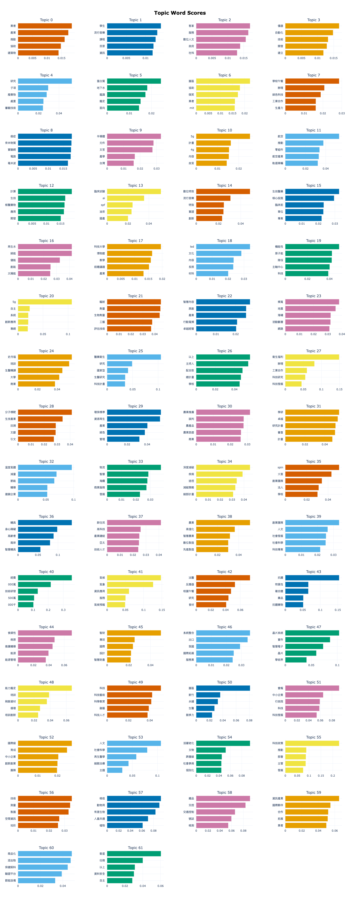

# helloBERTopic
本專案用來對 [BERTopic](https://github.com/MaartenGr/BERTopic) 進行一些應用、摘要與實驗
- [BERTopic文章](https://towardsdatascience.com/topic-modeling-with-bert-779f7db187e6)
- [論文](https://arxiv.org/abs/2203.05794)

## 執行結果
若成功執行完`main.py` 檔案，會在export資料夾中產生以下html檔案：
```
bar_fig.html
topic_fig.html
tot_fig.html
```
### Topics Bar



## 運作原理
BERTopic 透過對詞向量做 UMAP 降維特徵提取後，採用 HDBSCAN 來進行非監督式的分群動作。

### UMAP
與 tSNE 相似的降維演算法，在資料視覺化上都有著很好的效果。
- 步驟
  1. 計算點與其周遭可控數量鄰點的距離(Distance)。
  2. 確保當 data 降維到低維空間時，點與點之間的距離要與高維空間的距離關係是相似的。

### HDBSCAN
HDBSCAN 是針對 DBSCAN 的缺點來進行改善而提出的演算法。 
DBSCAN 的演算法假設個群集間的密度(Density)是相同的，然而當此假設運用在密度差異明顯的資料集上時，就會產生錯誤分群的結果。
兩者最主要的不同，在於他們對待邊界值(border points)的方式。HDBSCAN提出了有效的演算法從而改進了上述DBSCAN在特定狀況下產生錯誤分群的結果。

另外，HDBSCAN也保留了DBSCAN的特性，會自動對資料進行分群，而不用使用者自己設定分群數量。

### Other Clustering Method
如果不想要 HDBSCAN 演算法自動做分群，可以採用以下方法更換成 `KMeans` 或 `Birch` 分群演算法，細節參照官方文件
- [link](https://maartengr.github.io/BERTopic/getting_started/clustering/clustering.html#visual-overview)
```python
from bertopic import BERTopic
from sklearn.cluster import KMeans

cluster_model = KMeans(n_clusters=50)
topic_model = BERTopic(hdbscan_model=cluster_model)
```


## 專案結構
```
.
├── .gitignore
├── README.md
├── data
│   ├── data.csv
│   ├── keys
│   │   └── test.ipynb
│   ├── keys.txt
│   └── stopword.txt
├── exp.ipynb
├── main.py
├── requirements.txt
└── utils.py
```
## 安裝環境
```
pip install -r requirements.txt
```

## 執行程式
```
python main.py
```
### 參數說明
```
Hello BERTopics

optional arguments:
  -h, --help            show this help message and exit
  --topic_num TOPIC_NUM
                        設置要分成幾個topic
  --keyword_file KEYWORD_FILE
                        設置讀取keyword檔案名稱
  --model_name MODEL_NAME
                        設置HuggingFace的PretrainModel名稱
  --data_file DATA_FILE
                        設置資料讀取位置
  --word_sentence_cache WORD_SENTENCE_CACHE
                        是否讀取斷詞快取(如果沒有cache會走Default流程)
```
